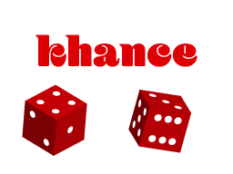

# Khance  
Generate realistic fake data for testing

Inspired by [Chance.js](https://github.com/chancejs/chancejs)

### Todo
- Basic functions
    - Symbols
    - Strings with numbers and symbols
    - String from pool of characters
- Personal Functions
- web functions
- Date/time functions
- Money functions
- Populate pojos and data structures